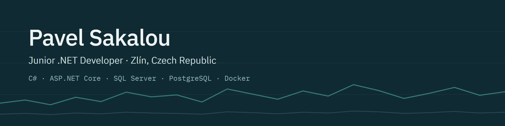
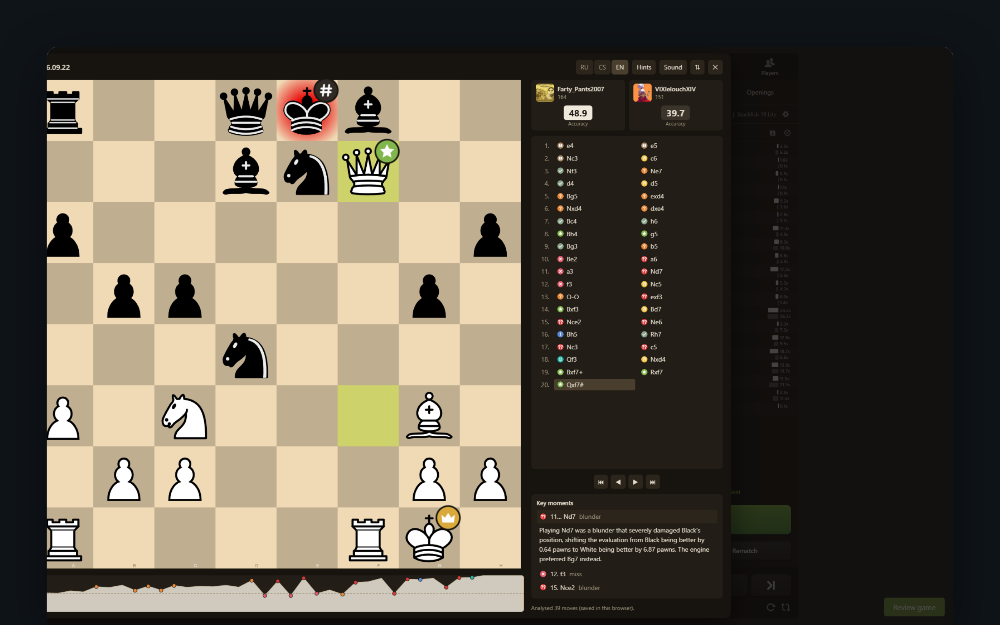
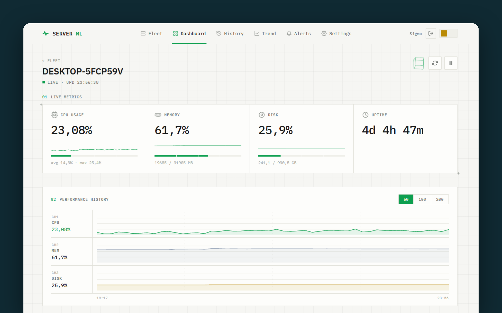

I finished my bachelor's in Software Engineering at Tomas Bata University in Zlín in 2026 and I'm looking for my
first developer job, ideally backend in C# and .NET. I like the part after the code too: my projects run on an old
laptop I turned into an Ubuntu home server.

**Open to work** · free access to the Czech labour market · [LinkedIn](https://www.linkedin.com/in/pavel-sakalou-dev/)

### Projects

<table>
  <tr>
    <td width="50%" valign="top">
      
      <h4><a href="https://github.com/SoftGene/ChessMIKU">ChessMIKU</a></h4>
      Post-game review for chess.com. A Chrome extension runs Stockfish in the browser; an ASP.NET Core API on
      .NET 10 with SQL Server stores the review, and a background worker asks an LLM to explain the worst moves.
        
      C# · ASP.NET Core · SQL Server · TypeScript · Gemini API · 530 tests
    </td>
    <td width="50%" valign="top">
      
      <h4><a href="https://github.com/SoftGene/ServerMonitor">ServerMonitor</a></h4>
      Self-hosted monitoring for a few machines: Linux and Windows agents, an ASP.NET Core API with PostgreSQL,
      a Blazor dashboard and Telegram alerts. Released as v1.0.0 and running on my home server.
        
      C# · ASP.NET Core · PostgreSQL · Blazor · Docker · 255 tests
    </td>
  </tr>
</table>

Also: [**SportMatchPredictor**](https://github.com/SoftGene/SportMatchPredictor), my bachelor's thesis — a WPF app
that predicts football results with an ML.NET model trained on about 25,000 matches

### How I work

- **Small steps.** One task, one branch, one pull request, and CI has to be green before it goes to `master`.
- **AI agents, with review.** I build with Claude Code and Gemini CLI: I plan the work with them and read every
  change as a code review. Code I don't understand doesn't go in.
- **Tests that can fail.** When a new test passes on the first run, I break the code on purpose to check that the
  test actually catches it.

### Stack

**Main:** C#, .NET, ASP.NET Core, Entity Framework Core, SQL Server, PostgreSQL, xUnit, Docker, GitHub Actions, Linux 
**Also:** Blazor, WPF, ML.NET, TypeScript, Angular
